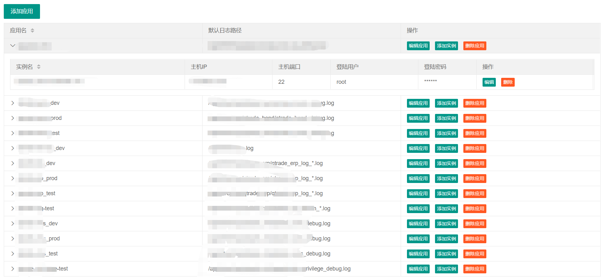
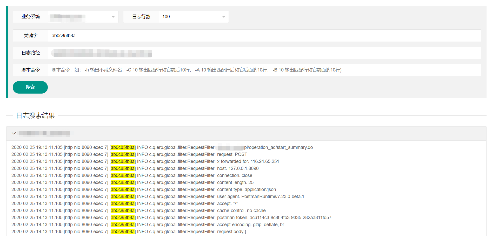

# sulan
#### 简介
封装基于Liunx命令grep（fgrep）的日志文件搜索系统。旨在给开发、测试、运维快捷定位线上测试、生产问题。
#### 体验地址
`http://106.13.230.2/sulan/`

#### 目前项目有两个页面
- 应用管理页面 `http://106.13.230.2/sulan/index.html`

- 日志搜索页面 `http://106.13.230.2/sulan/apps.html`

- 后续会增加一个结果快照页面